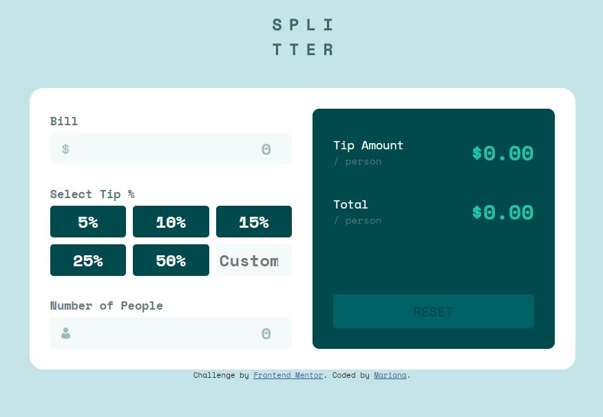

# Frontend Mentor - Tip calculator app solution

This is a solution to the [Tip calculator app challenge on Frontend Mentor](https://www.frontendmentor.io/challenges/tip-calculator-app-ugJNGbJUX). Frontend Mentor challenges help you improve your coding skills by building realistic projects.

## Table of contents

- [Overview](#overview)
  - [The challenge](#the-challenge)
  - [Screenshot](#screenshot)
  - [Links](#links)
- [My process](#my-process)
  - [Built with](#built-with)
  - [Continued development](#continued-development)
  - [Useful resources](#useful-resources)
- [Author](#author)

## Overview

### The challenge

Users should be able to:

- View the optimal layout for the app depending on their device's screen size
- See hover states for all interactive elements on the page
- Calculate the correct tip and total cost of the bill per person

### Screenshot

### Links

- Solution URL: [https://www.frontendmentor.io/solutions/app-with-many-eventlisteners-PZjaJwl6aF](https://www.frontendmentor.io/solutions/app-with-many-eventlisteners-PZjaJwl6aF)
- Live Site URL: [https://marianaceci.github.io/Frontend-Mentor-tip-calculator/](https://marianaceci.github.io/Frontend-Mentor-tip-calculator/)

## My process

### Built with

- Semantic HTML5 markup
- CSS custom properties
- Flexbox
- CSS Grid
- Mobile-first workflow

### Continued development

I'm sure my code could be cleaner. I will study some more JS and come back to this code and fix it. For now I'm happy that it works :)

### Useful resources

- [Example resource 1](https://www.youtube.com/watch?v=cBWUvTZPeKw&list=PLBf-QcbaigsJysJ-KFZvLGJvvW-3sfk1S&index=14) - This playlist really helped me to understand the fundamentals os JS and adding event listeners. 

## Author

- Frontend Mentor - [@marianaceci](https://www.frontendmentor.io/profile/marianaceci)
- LinkedIn - [Mariana Schmidt](https://www.linkedin.com/in/marianaceciliaschmidt)

